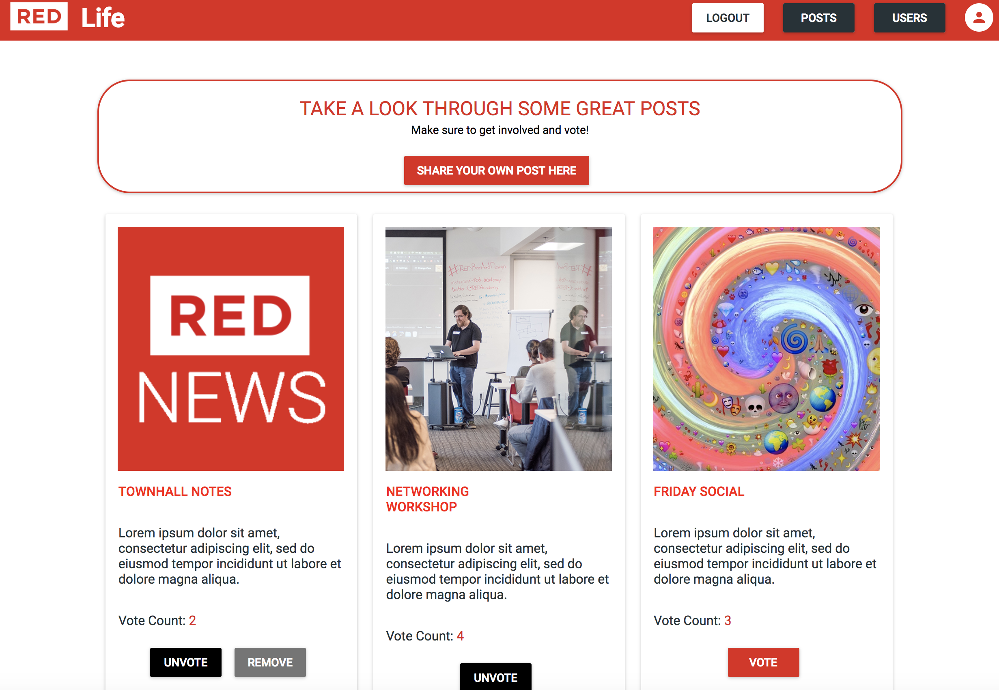

# RED-Stuff

React App - Social media application for students at RED Academy to get to know each other and share ideas for events.

<h3>ASK:</h3> 

Design and build a real-time JavaScript web application in a team environment. The social media app should allow students and staff at RED Academy to share their ideas/posts. Registered members should be able to edit their profile, post ideas and vote on ideas.

<h3>FINISHED PRODUCT:</h3> 
 The web application was built using Meteor as a platform. React was used as the rendering library. Data was stored using MongoDB as the database. Group performance was optimized by using Git for version control and collaboration. Hosted on Heroku.

